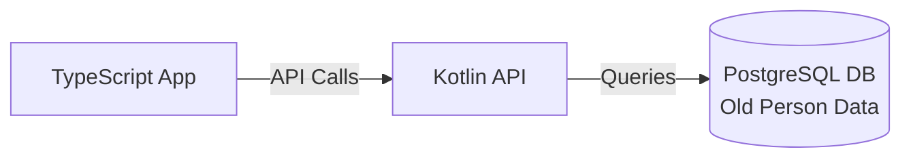
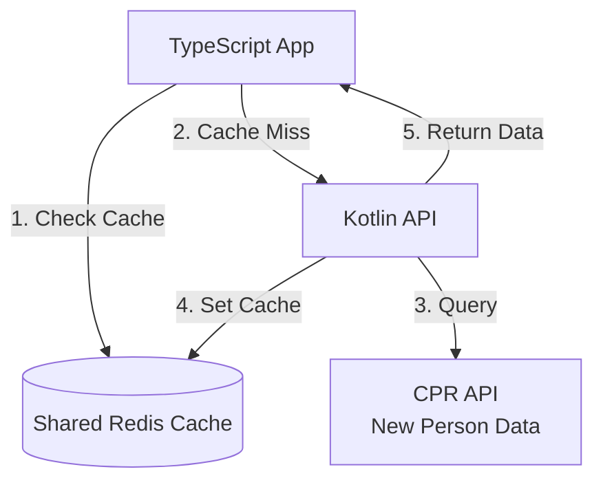
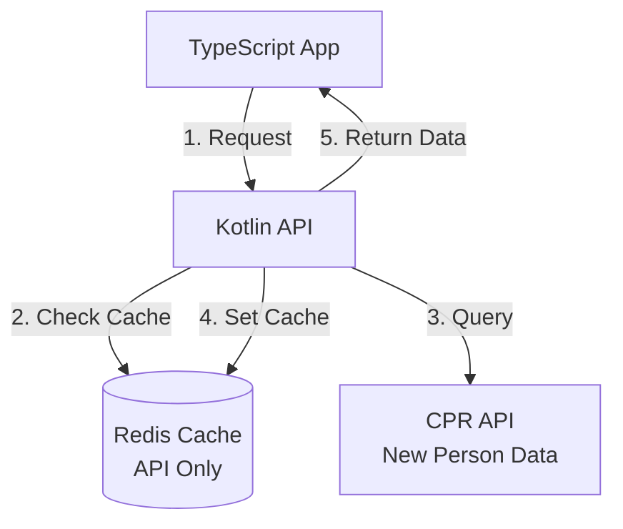

# Future Manage

## Proposed Solution: Redis Caching

#### Shared Redis

#### Non-Shared Redis

## Notes

- PostgreSQL = old person data
- CPR API = new person data
- Cache needs "live-ish" data
- Post V1: Integrate with CPR
