# Architecture Discussion Meeting Notes
**Date:** November 18, 2025

## Overview

This document outlines the three critical issues that were discussed in the FM US planning meeting yesterday. To keep it simple here are the four "apps" we are going to discuss. This is an issue for **FM** and **SAS**

- **ts** (Frontend), TypeScript frontend application
- **kotlin** (Backend), Aggregational backend service that collects data from multiple sources
- **casbe** (Backend), Backend service originally designed as a backend-for-frontend (BFF) for other apps
- **auth** (Backend), Authentication service

The **Kotlin backend** serves as an aggregation layer, collecting data from various sources (including **CASBE**) and presenting it to the **frontend**.

### System Architecture

```mermaid
graph TB
    TS[TS Frontend]
    KOTLIN[Kotlin Backend<br/>Aggregational]
    CASBE[CASBE Backend<br/>Originally BFF]
    AUTH[Auth Backend]
    OTHER[Other Data Sources]
    
    TS -->|1. Get JWT Token| AUTH
    AUTH -->|2. Return JWT Token| TS
    TS -->|🔥 3. Call aggregator<br/>HOT SPOT<br/>Requests + JWT Token| KOTLIN
    KOTLIN -->|4. Authenticates JWT Token| AUTH
    KOTLIN -->|🔥 5. Call CASBE<br/>HOT SPOT<br/>Aggregates| CASBE
    KOTLIN -->|Aggregates| OTHER
    CASBE -.->|🔥 ❓ AUTH ISSUE<br/>HOT SPOT<br/>How to authenticate?| AUTH
    
    style TS fill:#e1f5ff,stroke:#0066cc,stroke-width:2px,color:#003366
    style KOTLIN fill:#fff4e1,stroke:#cc6600,stroke-width:2px,color:#663300
    style CASBE fill:#ffe1f5,stroke:#cc0066,stroke-width:2px,color:#660033
    style AUTH fill:#e1ffe1,stroke:#00cc00,stroke-width:2px,color:#003300
    style OTHER fill:#f0f0f0,stroke:#666666,stroke-width:1px,color:#333333
    
    linkStyle 2 stroke:#ff6600,stroke-width:4px
    linkStyle 4 stroke:#ff6600,stroke-width:4px
    linkStyle 6 stroke:#ff0000,stroke-width:4px,stroke-dasharray: 5 5
```

---

## 🔥 HOT SPOT 3: Frontend → Kotlin Backend API Design

### Core Question

**What is this API?**
- Get all data in one response?
- Return data by tab?
- Return data by component?

**Is this a Backend-for-Frontend (BFF) call?**
- **If YES:** The API format is not RESTful, it's designed specifically to serve the app
- **If NO:** We need RESTful endpoints that return data, not screen-specific structures

### Context

The Kotlin backend aggregates data from multiple sources. We need to decide how the frontend consumes this aggregated data.

### Decision Points

1. **API Pattern**
  - **Option A:** Single endpoint returning all data (Bob's concern: too much data)
  - **Option B:** Tab-based endpoints
  - **Option C:** Component-based endpoints (fetch only what's needed per component)

2. **RESTful vs BFF**
  - **RESTful:** Generic endpoints that return structured data
  - **BFF:** App-specific endpoints optimized for UI screens

### Key Considerations

- SAS and FM are using a different Kotlin backends, Id a BFF acceptable.
- Need to ensure we're returning **data**, not just **data for a screen**
- What is the performance vs maintainability trade-offs?

---

## 🔥 HOT SPOT 5: Kotlin → CASBE Communication

### Core Question

**We have validated the JWT token for the Auth app. How do we call CASBE?**

CASBE is a backend-for-frontend. Do we need new endpoints?

### Context

- CASBE is not restful
- Kotlin backend needs to consume CASBE's data efficiently
- Using original endpoints returns way more data than needed
- Some json blobs in **CASBE** rely on business logic in the UI to make sense of the data. Issue for CAS1 and CAS3 (Bob has context) 

### Decision Points

1. **Do we need new endpoints in CASBE?**
  , **Option A:** Use existing CASBE endpoints (problem: screen-specific, too much data)
  , **Option B:** Create new backend-to-backend endpoints in CASBE
    , RESTful endpoints designed for data consumption
    , Field selection parameters (`?fields=name,status`)
    , Batch requests (`?ids=1,2,3`)

2. **How do we authenticate with CASBE?**
  - Kotlin backend has already validated the user's JWT token
  - **Option A:** Relay the original JWT token to CASBE
  - **Option B:** Use service-to-service authentication (client credentials)
  - **Option C:** Re-authenticate with Auth service

3. **Frontend Business Logic**
  - Do we need to replicate the business logic in existing FE apps in the new ones **SASUI (CAS1, CAS3)**, **FMUI (CAS1)** Copy and pasting contracts sounds a terrible idea --Stuart

### Key Considerations

- Don't want to spam CASBE service, need efficient data retrieval
- Some data from CASBE is just JSON blobs without context (context lives in frontend apps)
- Need to avoid recreating another BFF pattern
- Concerns that any change to CAS1, CAS3 data blogs will have instant impact of FM and SAS

---

## 🔥 HOT SPOT: AUTH ISSUE, Role-Based Authentication

### Core Question

**Each app that CASBE serves has a different means of authentication (ROLE from the Auth app?). How will this work with Auth app and CASBE?**

### Context

- CASBE serves multiple apps, each with different roles/permissions
- Auth app validates JWT tokens with specific roles
- Kotlin backend needs to call CASBE, but CASBE may need different role validation

### The Problem

### Decision Points

1. **How does CASBE validate roles?**
  - **Option A:** CASBE validates the same JWT token (requires same role structure)
  - **Option B:** CASBE uses different validation logic per app it serves
  - **Option C:** Service-to-service auth with role mapping

2. **Role Mapping Strategy**
  - Can Auth app issue tokens with multiple roles?
  - Does CASBE need to map roles from Auth app to its own role system?
  - How do we handle role conflicts between apps?

### Key Considerations

- CASBE uses different validation depending on which endpoint it calls
- CASBE serves different backends with different validation requirements
- Need to ensure role-based access control works across the entire flow

