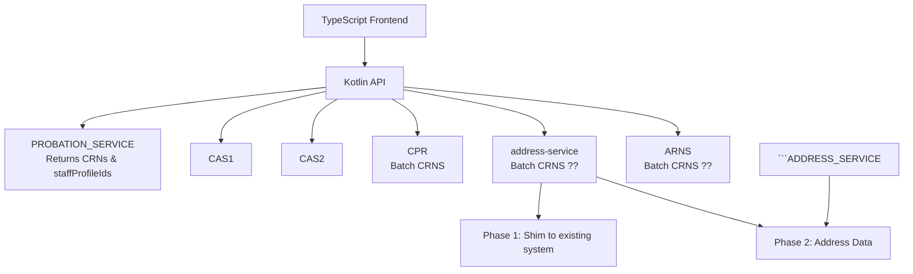

# System Architecture Diagram

PROBATION_SERVICE return say a list of crns, and staffProfileIds, from a teamId

Option 1. have PROBATION_DIGITAL be a sync call that is fed to the async aggreagator (easier)
Option 2. have some form of topological ordering in the APIS (harder)
