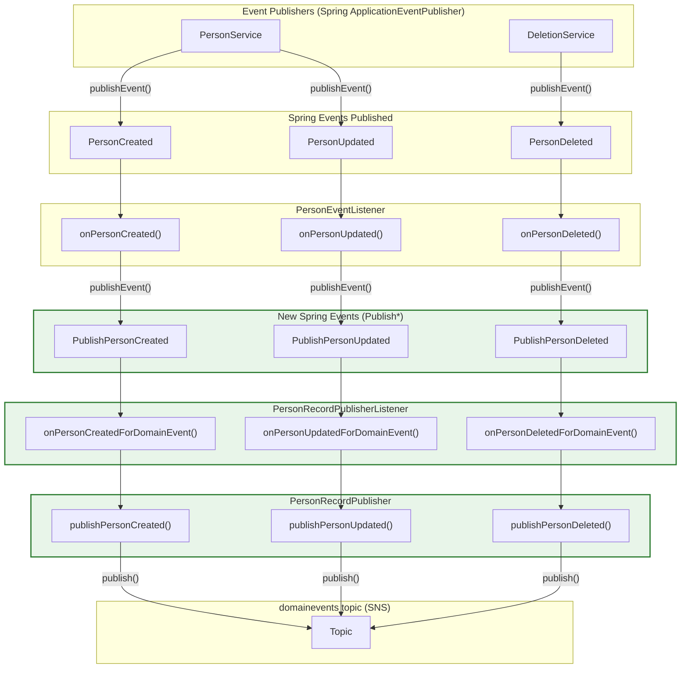

# Person Event Listener -> Domain Events Flow

## New functionality (these are the changes)

The following components were added to bridge `PersonEventListener` with the domain events topic:

- **PublishPerson\*** events (`PublishPersonCreated`, `PublishPersonUpdated`, `PublishPersonDeleted`) - new Spring events published by `PersonEventListener`
- **PersonRecordPublisherListener** - new listener that consumes `PublishPerson*` events and delegates to `PersonRecordPublisher`
- **PersonRecordPublisher** – publishes `PersonDomainEvent` payloads to the `domainevents` topic

These are highlighted in the diagram below.

---

## Mermaid Diagram

## Class References

| Class | Role |
|-------|------|
| `PersonService` | Publishes `PersonCreated` and `PersonUpdated` when processing person create/update |
| `DeletionService` | Publishes `PersonDeleted` when processing person deletion |
| `PersonEventListener` | `@EventListener` for PersonCreated/Updated/Deleted; publishes `RecordPersonTelemetry`, `RecordEventLog`, and `PublishPerson*` events |
| `PersonRecordPublisherListener` | `@EventListener` for `PublishPerson*` events; delegates to `PersonRecordPublisher` |
| `PersonRecordPublisher` | Publishes `PersonDomainEvent` to `domainevents` topic with event types: (See below) |

## Event Types (Domain Events Topic)

- `core-person-record.person.created`
- `core-person-record.person.updated`
- `core-person-record.person.deleted`
