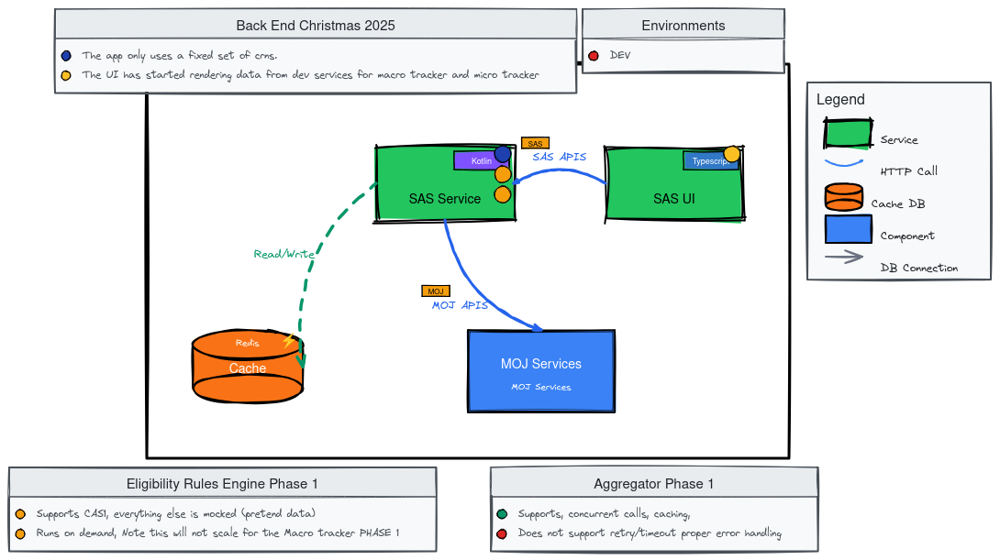
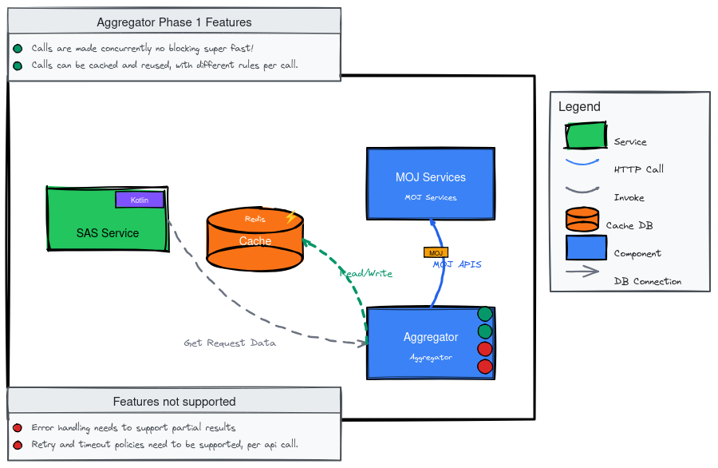
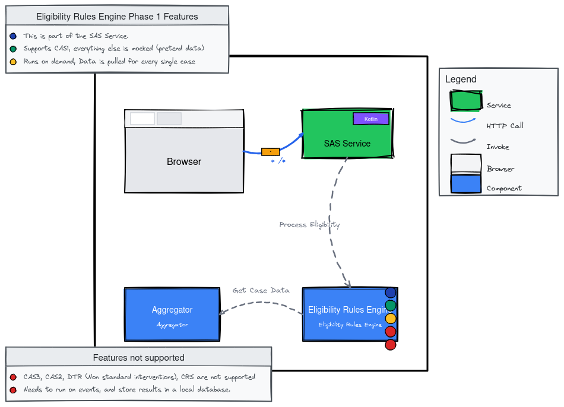
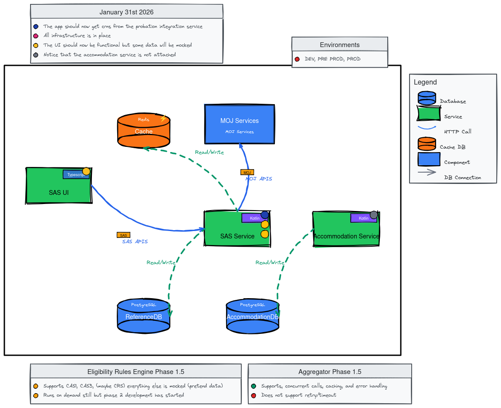
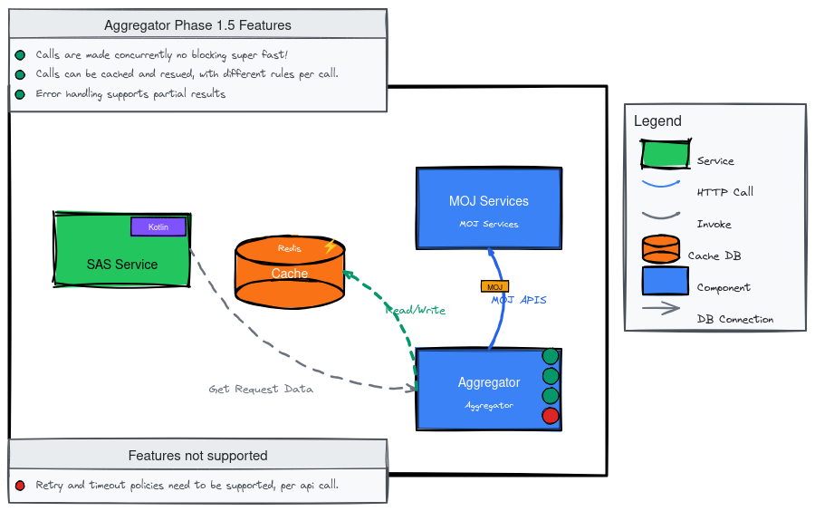

# State of Play

This document outlines the development progress up to the March release. Development will continue through summer, with a value assessment planned for March.

## Christmas 2025

**Current State:**
- Macro Tracker: Renders data
- Micro Tracker: Renders minimal data, including referral histories (excluding STR and CRS)

### Aggregator Phase 1

**Status:** In place and pulling real data (not yet filtered by logged-in user).

**Purpose:** Enables multiple asynchronous API calls simultaneously. Supports concurrency but lacks validation, error handling, and resilience. Works only in happy-path scenarios.

### Eligibility Rules Engine Phase 1

**Status:** Successfully processing CAS1 rules. Viable for micro tracker, not macro tracker.

**Purpose:** Basic rules engine that applies rules to datasets to provide indicators and guide business processes.

### Probation Integration

**Status:** Initial work identifying requirements and changes needed to access data from the probation integration team. Collaboration begins in January.

### Addresses

**Status:** Address data shape still being defined. Expected finalization in early to mid-January. Can run entirely parallel to single accommodation development work.

## January 2026

**Target State:** Infrastructure should be taking shape. UI functional with mix of real and mock data. May be missing proposed accommodations and/or DTR entry. Accommodation service added.

### Aggregator Phase 1.5

**Target:** Support graceful error handling and partial completions.

### Eligibility Rules Engine

**Target:** Processing CAS3 rules, potentially CRS (depending on probation integration). Defining more business behavior using pull technique (not viable for go-live). Work on better solution started.

### Addresses

**Target:** Ready to start as a work item. Can run parallel to other development.

## February 2026

**Target:** Aggregator should have retry and timeout functionality.
