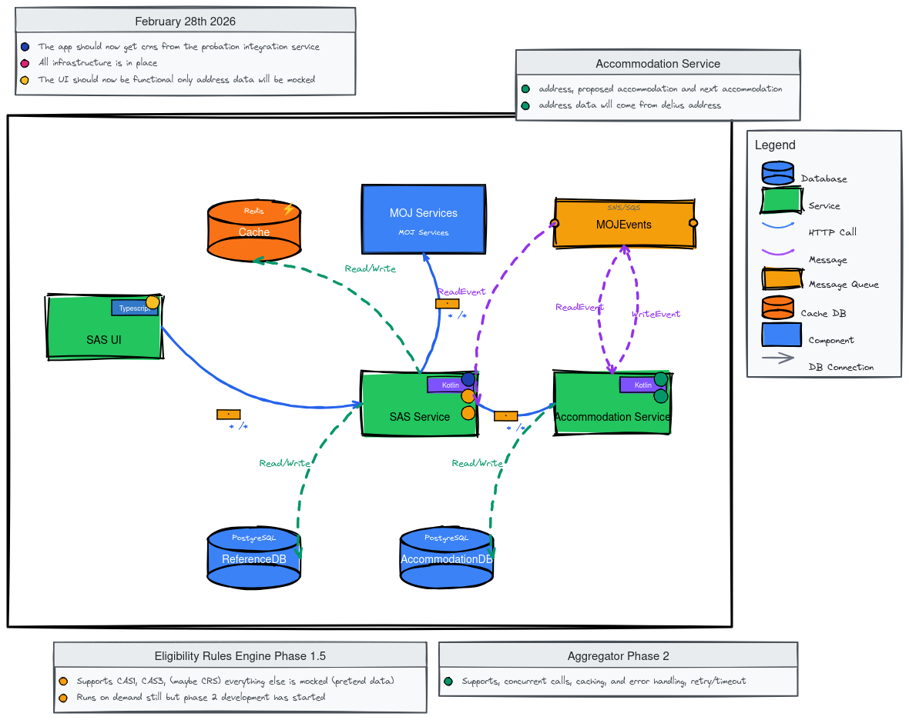
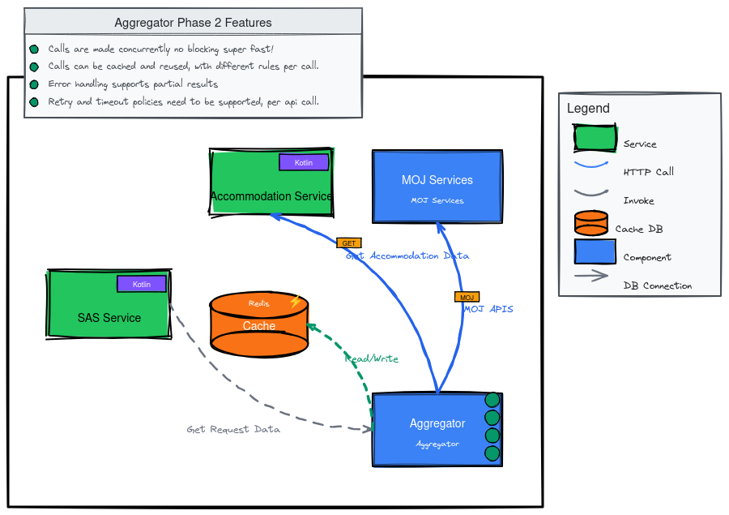
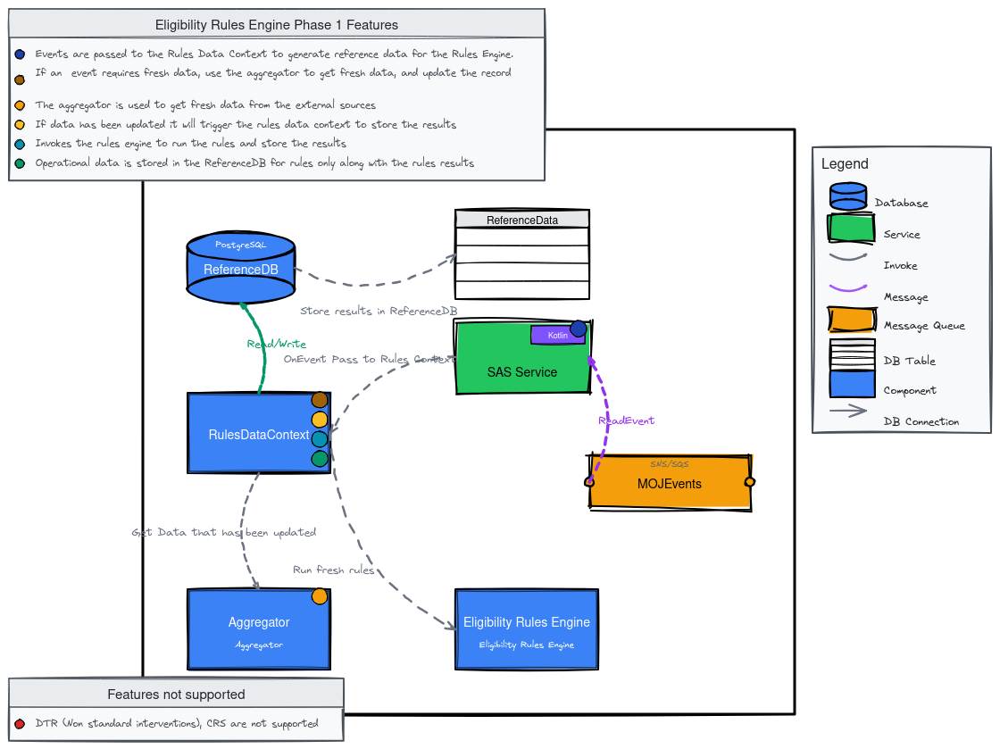
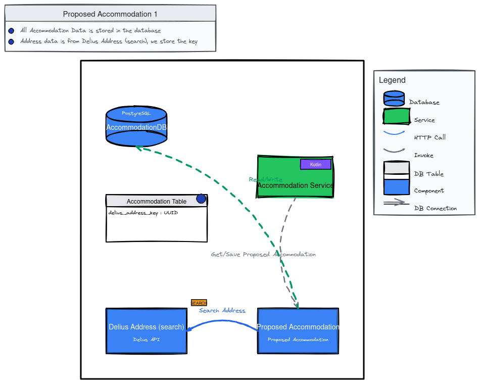
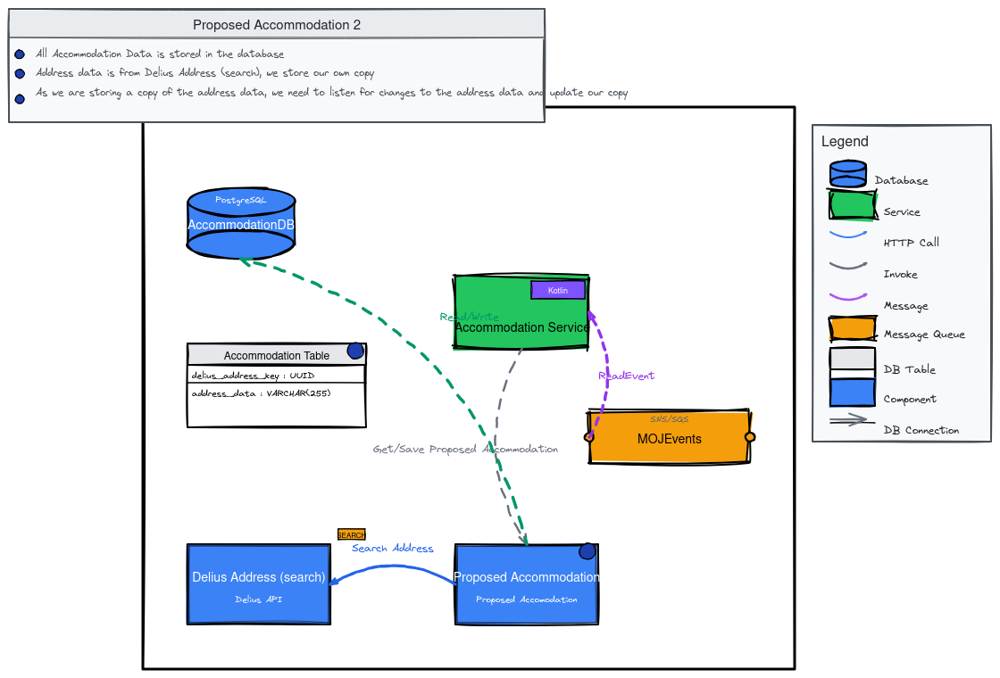
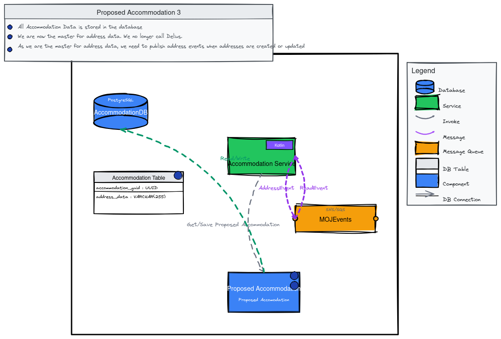

# State of Play

This document outlines the development progress up to the March release. Development will continue through summer, with a value assessment planned for March.

## Christmas 2025

**Diagram Description:**
This architecture diagram shows the backend system state at Christmas 2025. The system consists of:
- **SAS UI** (TypeScript): The user interface service that makes HTTP calls to SAS APIs
- **SAS Service** (Kotlin): The core backend service that handles business logic and coordinates with external services
- **Redis Cache**: Used by SAS Service for read/write caching operations
- **MOJ Services**: External component providing MOJ APIs consumed by SAS Service

**Key Context:**
- The application only uses a fixed set of CRNs (not yet filtered by logged-in user)
- The UI has started rendering data from dev services for both macro tracker and micro tracker
- Environment: DEV only

**Current State:**
- Macro Tracker: Renders data
- Micro Tracker: Renders minimal data, including referral histories (excluding DTR and CRS)

### Aggregator Phase 1

**Diagram Description:**
This diagram illustrates the Aggregator component architecture in Phase 1. The flow shows:
- **SAS Service** (Kotlin) invokes the Aggregator to "Get Request Data"
- **Aggregator** makes concurrent HTTP calls to **MOJ Services** via MOJ APIs
- **Aggregator** performs read/write operations with **Redis Cache** for caching

**Supported Features:**
- Calls are made concurrently and non-blocking (super fast)
- Calls can be cached and reused, with different rules applied per call

**Features Not Supported:**
- Error handling does not support partial results
- Retry and timeout policies are not supported per API call

**Status:** In place and pulling real data (not yet filtered by logged-in user).

**Purpose:** Enables multiple asynchronous API calls simultaneously. Supports concurrency but lacks validation, error handling, and resilience. Works only in happy-path scenarios.

### Eligibility Rules Engine Phase 1

**Diagram Description:**
This diagram shows the Eligibility Rules Engine Phase 1 architecture and data flow:
- **Browser** makes HTTP calls to **SAS Service** (Kotlin)
- **SAS Service** invokes the **Eligibility Rules Engine** to "Process Eligibility"
- **Aggregator** invokes the **Eligibility Rules Engine** to "Get Case Data"

**Key Features:**
- This is part of the SAS Service (integrated component)
- Supports CAS1 rules; everything else is mocked (pretend data)
- Runs on demand; data is pulled for every single case

**Features Not Supported:**
- CAS3, CAS2, DTR (Non-standard interventions), and CRS are not supported
- Needs to run on events and store results in a local database (not yet implemented)

**Status:** Successfully processing CAS1 rules. Viable for micro tracker, not macro tracker.

**Purpose:** Basic rules engine that applies rules to datasets to provide indicators and guide business processes.

### Probation Integration

**Status:** Initial work identifying requirements and changes needed to access data from the probation integration team. Collaboration begins in January.

### Addresses

**Status:** Address data shape still being defined. Expected finalization in early to mid-January. Can run entirely parallel to single accommodation development work.

## January 2026

**Diagram Description:**
This architecture diagram shows the expanded system state for January 31st, 2026. The system now includes:
- **SAS UI** (TypeScript): Makes HTTP calls to SAS APIs
- **SAS Service** (Kotlin): Core service with read/write access to multiple databases
- **Redis Cache**: Used by both SAS Service and MOJ Services for caching
- **MOJ Services**: External component providing MOJ APIs
- **PostgreSQL ReferenceDB**: New database for reference data storage
- **PostgreSQL AccommodationDB**: New database for accommodation data storage
- **Accommodation Service** (Kotlin): New service shown but explicitly noted as "not attached" to the main system flow

**Key Context:**
- Application should get CRNs from the probation integration service
- All infrastructure is in place
- UI should now be functional but some data will be mocked
- Accommodation service is not yet attached to the main system
- Environments: DEV, PRE PROD, PROD

**Target State:** Infrastructure should be taking shape. UI functional with mix of real and mock data. May be missing proposed accommodations and/or DTR entry. Accommodation service added.

### Aggregator Phase 1.5

**Diagram Description:**
This diagram shows the Aggregator Phase 1.5 improvements. The architecture remains similar to Phase 1:
- **SAS Service** (Kotlin) invokes the Aggregator to "Get Request Data"
- **Aggregator** makes HTTP calls to **MOJ Services** via MOJ APIs
- **Aggregator** performs read/write operations with **Redis Cache**

**Supported Features:**
- Calls are made concurrently and non-blocking (super fast)
- Calls can be cached and reused, with different rules applied per call
- Error handling now supports partial results (new in Phase 1.5)

**Features Not Supported:**
- Retry and timeout policies are still not supported per API call

**Target:** Support graceful error handling and partial completions.

### Eligibility Rules Engine

**Target:** Processing CAS3 rules, potentially CRS (depending on probation integration). Defining more business behavior using pull technique (not viable for go-live). Work on better solution started.

### Probation Integration

**Target:** Endpoints providing CRN data for logged-in users. Integration with probation team ongoing.

### Addresses

**Target:** Ready to start as a work item. Can run parallel to other development.

## February 2026

**Diagram Description:**
This architecture diagram shows the complete system state for February 28th, 2026. The full infrastructure is now in place:
- **SAS UI** (TypeScript): Makes HTTP calls to SAS APIs
- **SAS Service** (Kotlin): Core service with full integration
- **Accommodation Service** (Kotlin): Now fully attached and integrated into the system
- **Redis Cache**: Used by SAS Service for caching
- **PostgreSQL ReferenceDB**: Stores reference data and rules results
- **PostgreSQL AccommodationDB**: Stores accommodation data (address, proposed accommodation, next accommodation)
- **MOJ Services**: External component providing MOJ APIs
- **MOJEvents (SNS/SQS)**: Message queue for event-driven communication
  - Accommodation Service publishes `WriteEvent` messages
  - Both SAS Service and Accommodation Service consume `ReadEvent` messages

**Key Context:**
- Application retrieves CRNs from probation integration service
- Accommodation Service handles address data (from Delius), proposed accommodation, and next accommodation
- Full event-driven architecture with MOJEvents message queue

**Target State:** 
- Application retrieves CRNs from probation integration service
- All infrastructure in place
- UI functional (only address data mocked)
- DTR backend investigation underway
- Proposed accommodation flow taking shape (address work excluded)

### Aggregator Phase 2

**Diagram Description:**
This diagram shows the Aggregator Phase 2 MVP with complete feature set. The architecture includes:
- **SAS Service** (Kotlin): Invokes the Cache and coordinates with Aggregator
- **Aggregator**: Central component that orchestrates API calls
  - Invoked by SAS Service to "Get Request Data"
  - Makes HTTP calls to **Accommodation Service** (GET request for "Get Accommodation Data")
  - Makes HTTP calls to **MOJ Services** via MOJ APIs
  - Performs read/write operations with **Redis Cache**

**Supported Features (MVP Complete):**
- Calls are made concurrently and non-blocking (super fast)
- Calls can be cached and reused, with different rules applied per call
- Error handling supports partial results
- Retry and timeout policies are supported per API call (new in Phase 2)

**Status:** MVP complete.

**Features:**
- Concurrent API calls
- Caching support
- Error handling with retry and timeout functionality

### Eligibility Rules Engine Phase 1.5

**Status:** Supports CAS1 and CAS3 rules. CRS support depends on probation integration. All other data mocked.

**Limitations:** Still runs on-demand (pull technique). Phase 2 development started.

### Accommodation Service

**Status:** Service added with support for:
- Address data (from Delius)
- Proposed accommodation
- Next accommodation

## Post February

### Eligibility Rules Engine Phase 2

**Diagram Description:**
This diagram illustrates the event-driven Eligibility Rules Engine Phase 2 architecture. The flow shows:
- **MOJEvents (SNS/SQS)**: Message queue that receives `ReadEvent` messages from SAS Service
- **SAS Service** (Kotlin): Receives events from MOJEvents and invokes RulesDataContext
- **RulesDataContext**: Component that orchestrates the rules processing flow
  - Receives events from SAS Service ("OnEvent Pass to Rules Context")
  - Invokes **Aggregator** to "Get Data that has been updated" when fresh data is needed
  - Invokes **Eligibility Rules Engine** to "Run fresh rules" when data is updated
  - Has read/write DB connection to **ReferenceDB**
- **Aggregator**: Fetches fresh data from external sources when events require it
- **Eligibility Rules Engine**: Processes rules and generates results
- **ReferenceDB (PostgreSQL)**: Stores operational data and rules results in the **ReferenceData** table

**Event Flow:**
1. Events from MOJEvents queue are passed to RulesDataContext via SAS Service
2. RulesDataContext generates reference data for the Rules Engine
3. When events require fresh data, Aggregator fetches and updates records
4. Updated data triggers Rules Engine to run and store results
5. Results are stored in ReferenceDB (ReferenceData table with CRN and rules_results)

**Target:** Event-driven architecture replacing on-demand pull technique.

**Key Features:**
- **Event Processing:** Events from MOJEvents queue passed to Rules Data Context
- **Reference Data Generation:** Rules Data Context generates reference data for the Rules Engine
- **Fresh Data Handling:** When events require fresh data, aggregator fetches and updates records
- **Automatic Rule Execution:** Updated data triggers rules engine to run and store results
- **Data Storage:** Operational data and rules results stored in ReferenceDB

**Limitations:**
- DTR (Non-standard interventions) not supported
- CRS not supported

**Architecture:**
- Event-driven flow: MOJEvents → SAS Service → Rules Data Context
- Integration with Aggregator for fresh data retrieval
- Results persisted in ReferenceDB (ReferenceData table with CRN and rules_results)

### Address 

The address phases represent a migration strategy from using Delius as the source of truth for address data to becoming the master data source ourselves. Each phase builds upon the previous one, gradually reducing dependency on Delius while improving data ownership and quality.

## Phase 1: Reference-Only Model

**Diagram Description:**
This diagram shows the Phase 1 address architecture with minimal data storage:
- **AccommodationDB (PostgreSQL)**: Database containing the Accommodation Table
- **Accommodation Table**: Stores only `delius_address_key` (UUID) - no actual address data
- **Read/Write Accommodation Service** (Kotlin): Service that manages accommodation data with DB connection to AccommodationDB
- **Proposed Accommodation**: Component that invokes the Accommodation Service to "Get/Save Proposed Accommodation"
- **Delius Address (search)**: External component (Delius API) that provides address search functionality
  - Proposed Accommodation makes HTTP calls to search addresses via "Search Address" (SEARCH)

**Data Flow:**
1. Proposed Accommodation component searches for addresses via HTTP call to Delius Address (search) API
2. When saving, Proposed Accommodation invokes Accommodation Service
3. Accommodation Service stores only the `delius_address_key` reference in the database
4. Actual address data is never stored locally; always fetched on-demand from Delius

**Key Characteristics:**
- **Data Storage**: Only stores the `delius_address_key` (UUID) in the Accommodation Table
- **External Dependency**: Calls Delius Address (search) API to retrieve address data
- **Data Ownership**: No local copy of address data; always fetches from Delius

**Architecture:**
- Proposed Accommodation component calls Delius Address (search) via HTTP
- Database stores only the reference key, not the actual address data
- Address data is always retrieved on-demand from Delius

**Benefits:**
- Minimal data storage requirements
- Always uses the latest data from Delius
- Simple implementation

**Limitations:**
- Requires Delius API to be available for every address lookup
- No offline capability
- Performance depends on Delius API response times

---

## Phase 2: Local Copy with Event-Driven Updates

**Diagram Description:**
This diagram shows Phase 2 architecture with local address data storage and event-driven synchronization:
- **AccommodationDB (PostgreSQL)**: Database containing the Accommodation Table
- **Accommodation Table**: Now stores both `delius_address_key` (UUID) and `address_data` (VARCHAR) locally
- **Read/Write Accommodation Service** (Kotlin): Service that manages accommodation data
  - Has DB connection to AccommodationDB
  - Publishes `ReadEvent` messages to MOJEvents (SNS/SQS) message queue
- **MOJEvents (SNS/SQS)**: Message queue that receives `ReadEvent` messages from Accommodation Service
- **Proposed Accommodation**: Component that still calls Delius API and invokes Accommodation Service
- **Delius Address (search)**: External component (Delius API) still used for address searches

**Data Flow:**
1. Proposed Accommodation searches addresses via HTTP call to Delius Address (search) API
2. Proposed Accommodation invokes Accommodation Service to get/save proposed accommodation
3. Accommodation Service stores both the `delius_address_key` and `address_data` locally
4. Accommodation Service publishes `ReadEvent` messages to MOJEvents when addresses are read
5. When Delius address data changes, MOJEvents triggers updates to the local copy via `ReadEvent` consumption

**Key Characteristics:**
- **Data Storage**: Stores both `delius_address_key` and `address_data` (VARCHAR) locally
- **External Dependency**: Still calls Delius Address (search) API
- **Event-Driven Updates**: Listens to `ReadEvent` from MOJEvents to update local copy when Delius data changes

**Architecture:**
- Proposed Accommodation component still calls Delius Address (search) via HTTP
- Database now stores a local copy of address data
- Accommodation Service listens to `ReadEvent` messages from MOJEvents
- When address data changes in Delius, events trigger updates to the local copy

**Benefits:**
- Local copy provides faster access to address data
- Can operate with cached data even if Delius API is temporarily unavailable
- Event-driven updates keep local copy synchronized

**Limitations:**
- Still dependent on Delius as the source of truth
- Requires event infrastructure (MOJEvents) to maintain synchronization
- Potential for data inconsistency if events are missed

---

## Phase 3: Master Data Source

**Diagram Description:**
This diagram shows Phase 3 architecture where the system becomes the master data source for addresses:
- **AccommodationDB (PostgreSQL)**: Database containing the Accommodation Table
- **Accommodation Table**: Stores `accommodation_guid` (UUID) and `address_data` (VARCHAR)
  - Note: Primary identifier changed from `delius_address_key` to `accommodation_guid`
- **Read/Write Accommodation Service** (Kotlin): Service that manages accommodation data
  - Has DB connection to AccommodationDB
  - Publishes `AddressEvent` messages to MOJEvents when addresses are created or updated
  - Consumes `ReadEvent` messages from MOJEvents
- **MOJEvents (SNS/SQS)**: Message queue that handles both `AddressEvent` (published) and `ReadEvent` (consumed)
- **Proposed Accommodation**: Component that invokes Accommodation Service to get/save proposed accommodation
  - No longer makes HTTP calls to Delius Address (search) - that component has been removed

**Key Changes from Phase 2:**
- Delius Address (search) component and all HTTP calls to Delius have been removed
- System is now the master for address data; no external dependency
- Primary identifier changed from `delius_address_key` to `accommodation_guid`
- Added `AddressEvent` publishing when addresses are created or updated

**Key Characteristics:**
- **Data Ownership**: Now the master for address data; no longer calls Delius
- **Data Storage**: Changed from `delius_address_key` to `accommodation_guid` as the identifier
- **Event Publishing**: Publishes `AddressEvent` to MOJEvents when addresses are created or updated
- **Event Consumption**: Still listens to `ReadEvent` from MOJEvents

**Architecture:**
- Removed Delius Address (search) component and HTTP calls
- Proposed Accommodation component is now the source of truth
- Accommodation Service publishes `AddressEvent` messages to MOJEvents when addresses change
- Accommodation Service continues to listen to `ReadEvent` messages

**Benefits:**
- Complete independence from Delius
- Full control over address data quality and structure
- Other services can consume address events from MOJEvents
- Uses our own identifier (`accommodation_guid`) instead of Delius keys

**Changes from Phase 2:**
- Removed dependency on Delius Address (search) API
- Changed primary identifier from `delius_address_key` to `accommodation_guid`
- Added `AddressEvent` publishing capability
- No longer fetches data from external source

---

## Phase 4: Data Migration and Cleansing

**Diagram Description:**
This diagram shows Phase 4 architecture, which maintains the same structure as Phase 3 but acknowledges data quality issues:
- **AccommodationDB (PostgreSQL)**: Database containing the Accommodation Table
- **Accommodation Table**: Stores `accommodation_guid` (UUID) and `address_data` (VARCHAR)
  - Contains migrated Delius data that has poor quality and needs cleansing
- **Read/Write Accommodation Service** (Kotlin): Service that manages accommodation data
  - Has DB connection to AccommodationDB
  - Publishes `AddressEvent` messages to MOJEvents
  - Consumes `ReadEvent` messages from MOJEvents
- **MOJEvents (SNS/SQS)**: Message queue handling `AddressEvent` and `ReadEvent` messages
- **Proposed Accommodation**: Component that invokes Accommodation Service

**Key Context:**
- Architecture is identical to Phase 3 (master data source)
- The Accommodation Table contains migrated address data from Delius
- Migrated data has known quality issues that need to be addressed
- Data cleansing is identified as post-release work (system can go live with known issues)

**Key Characteristics:**
- **Data Quality**: Acknowledges that migrated Delius data has poor quality
- **Migration Required**: Need to migrate and cleanse existing address data
- **Post-Release Work**: Data cleansing exercise can be fixed post-release
- **Same Architecture**: Maintains Phase 3 architecture (master data source)

**Architecture:**
- Same as Phase 3 (master data source)
- Accommodation Table contains migrated Delius data that needs cleansing
- Data quality improvement is identified as a post-release activity

**Benefits:**
- Maintains independence from Delius
- Clear acknowledgment of data quality issues
- Structured approach to data improvement

**Challenges:**
- Existing data quality issues from Delius migration
- Requires data cleansing and migration strategy
- Post-release work means system can go live with known data quality issues

**Next Steps:**
- Develop data cleansing rules and processes
- Plan migration strategy for improving data quality
- Implement validation and quality checks for new address data

---

## Phase Comparison Summary

| Aspect | Phase 1 | Phase 2 | Phase 3 | Phase 4 |
|--------|---------|---------|---------|---------|
| **Delius Dependency** | High (API calls) | High (API calls + events) | None | None |
| **Data Storage** | Key only | Key + local copy | Full data (own ID) | Full data (own ID) |
| **Data Ownership** | Delius | Delius | Ours | Ours |
| **Event Publishing** | No | No | Yes (AddressEvent) | Yes (AddressEvent) |
| **Event Consumption** | No | Yes (ReadEvent) | Yes (ReadEvent) | Yes (ReadEvent) |
| **Primary Identifier** | delius_address_key | delius_address_key | accommodation_guid | accommodation_guid |
| **Data Quality** | N/A | N/A | Assumed good | Poor (needs cleansing) |

## Migration Path

The phases represent a clear migration path:

1. **Phase 1 → Phase 2**: Add local caching to improve performance while maintaining Delius dependency
2. **Phase 2 → Phase 3**: Break dependency on Delius and become the master data source
3. **Phase 3 → Phase 4**: Acknowledge and plan for data quality improvements on migrated data

## Key Decisions

- **Phase 2**: Decision to store local copies while still depending on Delius
- **Phase 3**: Decision to break away from Delius and become the master
- **Phase 4**: Decision to accept data quality issues initially and address them post-release

