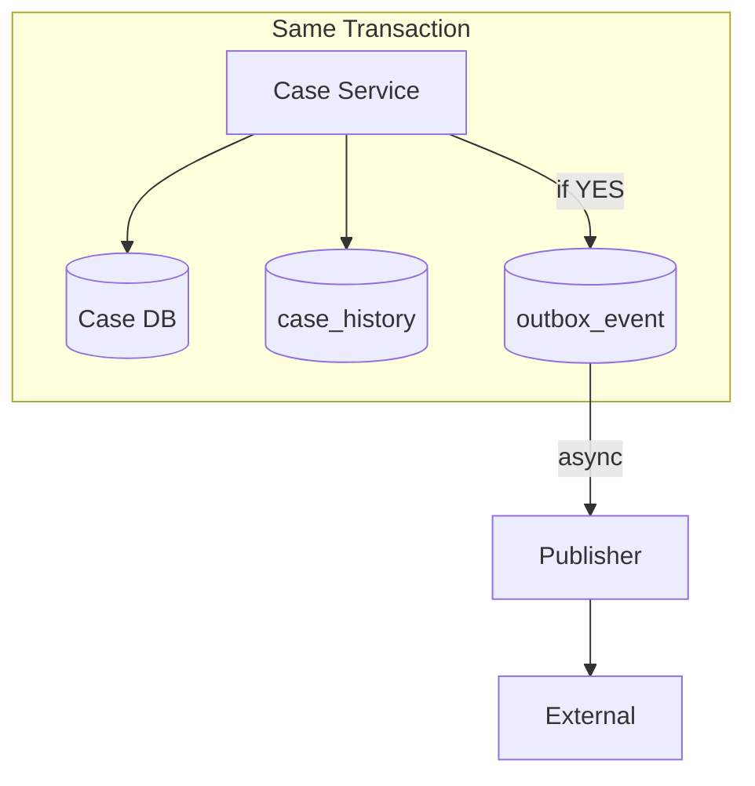

# Spike - Building the Proposed Accommodation timeline

_Question : Should the outbox record be used as the auditing record to aid building the address timeline component?_

### Two distinct concerns:

1. **Integration/Publishing** - reliably delivering events to external systems  
2. **Timeline/Audit** - what changed, when, for UI and audit

**Proposal:** Keep **outbox** for integration only. Use **case_history** for timeline and audit.

| Concern | Approach |
|---------|----------|
| Integration | Outbox table - transactional, purged after publish |
| Timeline & Audit | `case_history` table - append-only, retained |

---

## Why Separate Them

| Conflation | Problem |
|------------|---------|
| Outbox = Audit | Outbox is purged after publishing - we can never purge if it's our audit source |
| Outbox = Timeline | Outbox is for messaging reliability; timeline needs stable schema and long retention |
| emitEvent in domain event | Mixes "something changed" with "publish externally" - keep at integration boundary |

**Benefits of separation:**
- Outbox can be purged safely
- Case history gives us audit
- Stable query model for timeline UI
- No coupling to publisher retries/duplicates

---

## Flow

1. Always raise `ProposedAccommodationUpdatedDomainEvent` when accommodation changes
2. Same transaction: write to `case_history` (always) and `outbox_event` (only when `nextAccommodationStatus == YES` ?)
3. Conditional publishing stays at integration boundary - not in the domain event

---

## case_history Schema

_TBD_

---

## Architecture

### References

- Related Jira: [SAS-212](https://dsdmoj.atlassian.net/browse/SAS-212)
- Existing work: `POST /cases/{crn}/proposed-accommodations` and `outbox_event` table
